# Sissoporte

Sistema web de gestión para talleres de soporte técnico y reparación de equipos, desarrollado para **Nexos**. Administra el ciclo completo de una orden de servicio: recepción del equipo, seguimiento de estados, garantías, clientes, reportes y notificaciones al cliente por WhatsApp.

## Capturas de pantalla

| Landing pública | Dashboard |
|---|---|
| 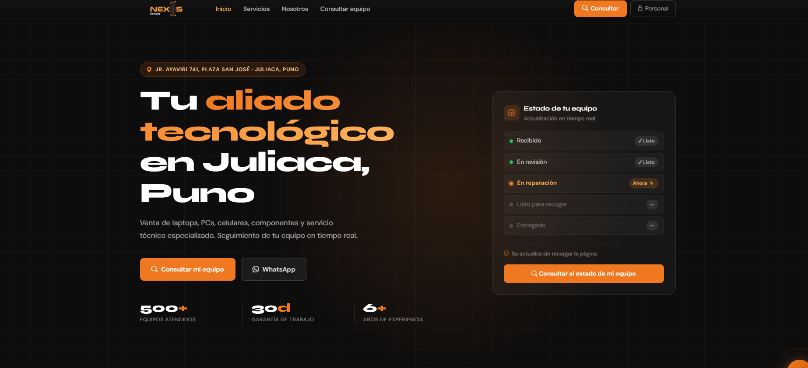 | 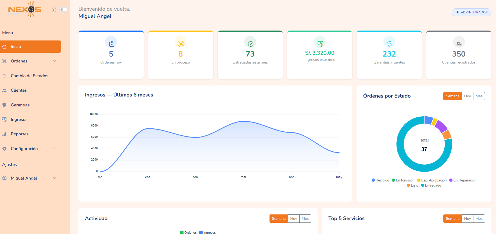 |

| Lista de órdenes | Nueva orden |
|---|---|
| 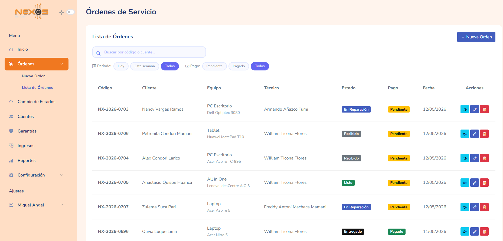 | 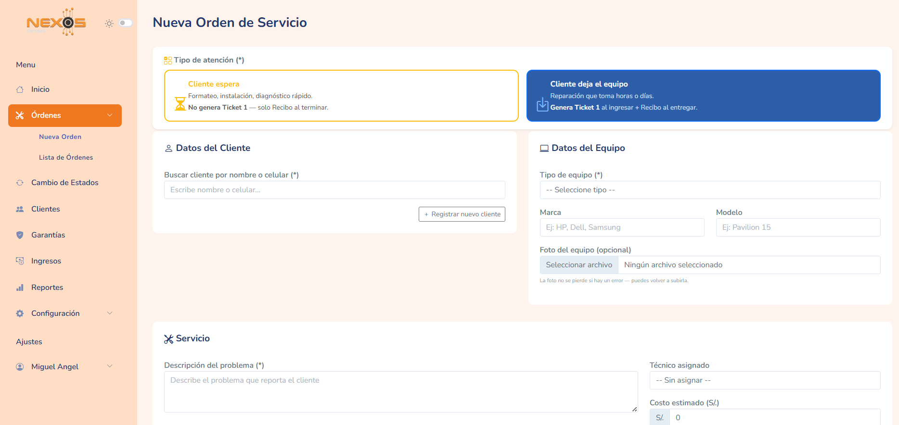 |

| Clientes | Garantías |
|---|---|
| 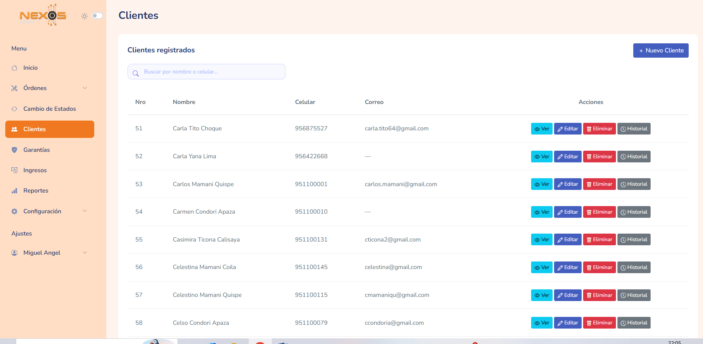 | 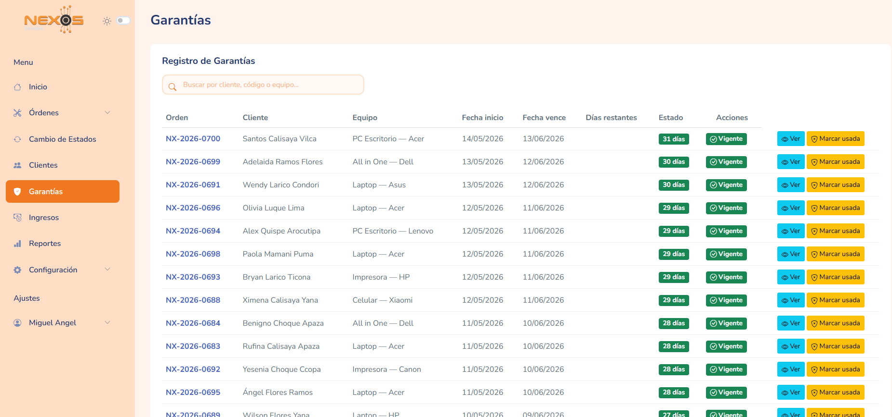 |

| Ingresos | Reportes |
|---|---|
| 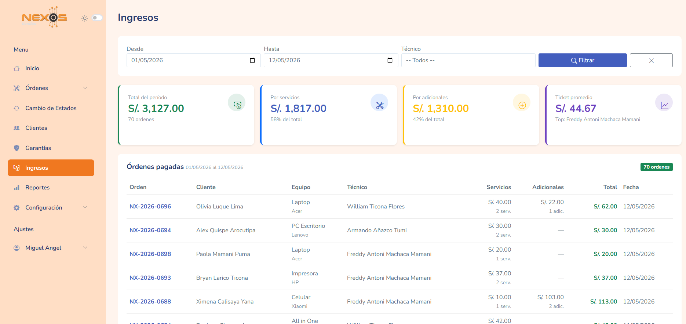 | 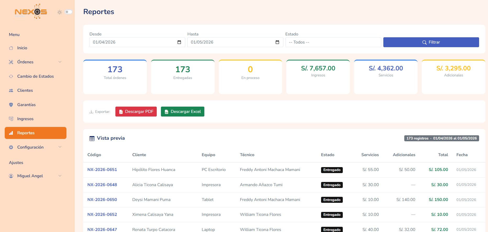 |

| Catálogo de servicios | Permisos por rol |
|---|---|
| 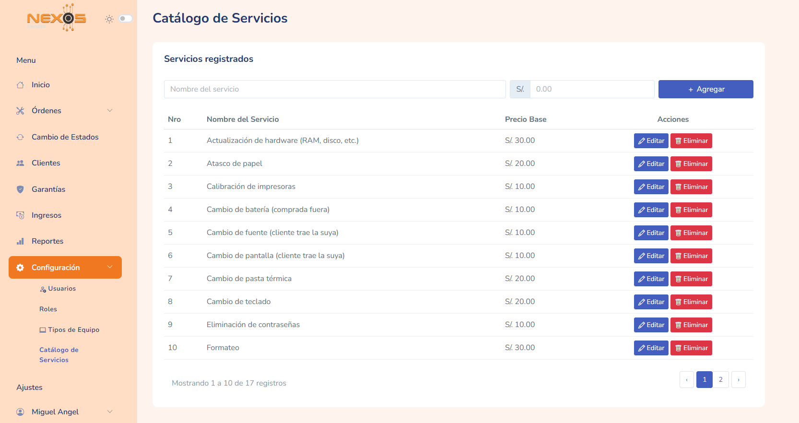 | 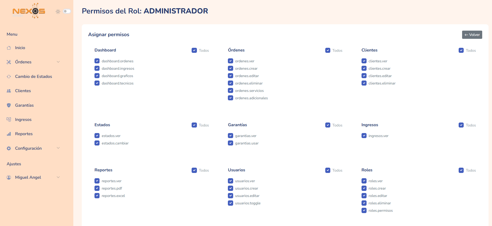 |

| Consulta pública | Comprobante de entrega |
|---|---|
| 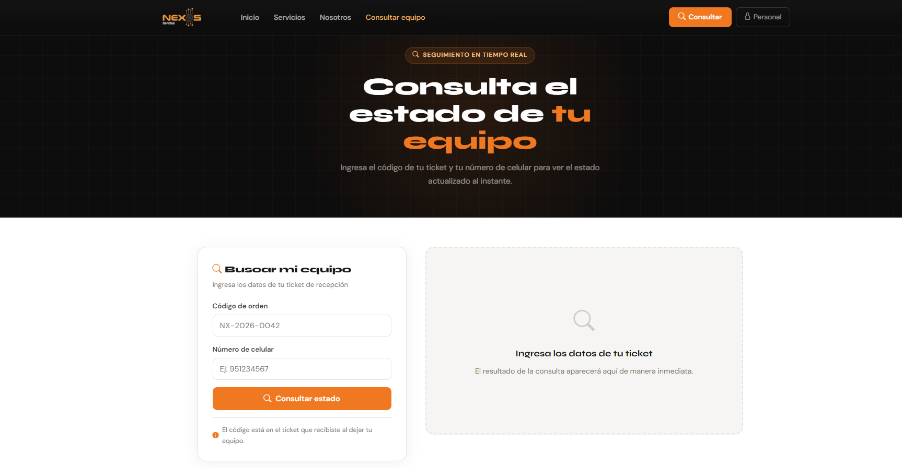 | 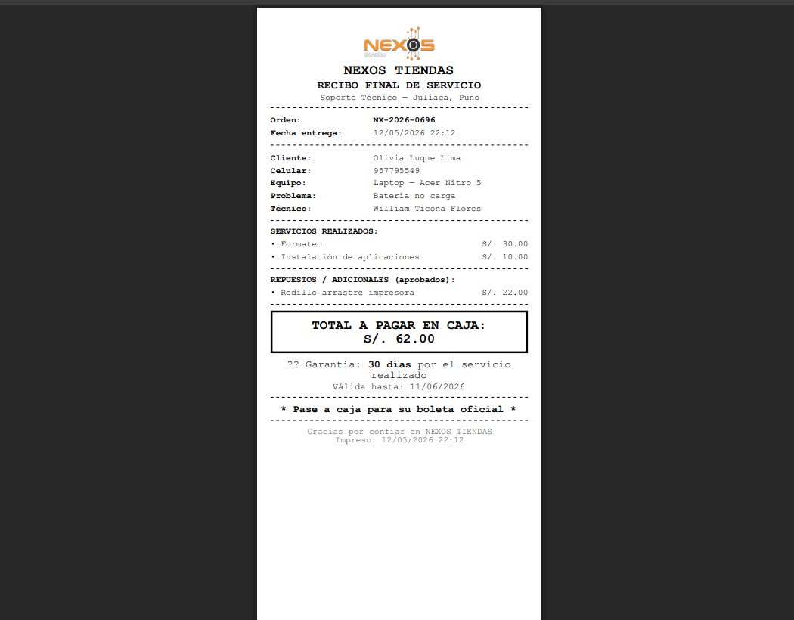 |

## Características principales

- **Gestión de órdenes de servicio**: creación, edición, cambio de estado, servicios y adicionales, entrega directa y tickets en PDF.
- **Clientes**: registro, historial de órdenes por cliente, búsqueda y filtros con AJAX (debounce, paginación, filtros tipo píldora).
- **Garantías**: seguimiento y marcado de uso de garantías por orden.
- **Roles y permisos**: control de acceso granular con Spatie Permission (Administrador, Técnico, Recepción).
- **Reportes**: exportación a PDF (DomPDF) y Excel (Maatwebsite/Excel) de ingresos y actividad.
- **Dashboard**: gráficos de actividad, top de servicios y estado de órdenes por periodo.
- **Chatbot con IA**: asistente de consulta para clientes usando la API de Groq.
- **Notificaciones WhatsApp**: envío de actualizaciones de estado vía UltraMsg.
- **Consulta pública**: los clientes pueden verificar el estado de su equipo sin necesidad de autenticarse.

## Stack tecnológico

| Categoría        | Tecnología                              |
|-------------------|------------------------------------------|
| Backend           | Laravel 12 (PHP 8.2+)                   |
| Base de datos     | MySQL                                   |
| Frontend          | Blade, Bootstrap 5, AJAX                |
| Permisos          | Spatie Laravel Permission               |
| PDF               | barryvdh/laravel-dompdf                 |
| Excel             | maatwebsite/excel                       |
| IA                | Groq API                                |
| Mensajería        | UltraMsg (WhatsApp API)                 |
| UI/UX             | SweetAlert2                             |

## Requisitos previos

- PHP >= 8.2
- Composer
- Node.js y npm
- MySQL

## Instalación

```bash
# Clonar el repositorio
git clone https://github.com/alessa2614/sissoporte.git
cd sissoporte

# Instalar dependencias PHP
composer install

# Instalar dependencias de JavaScript
npm install

# Copiar el archivo de entorno y generar la clave de aplicación
cp .env.example .env
php artisan key:generate

# Configurar la base de datos y las claves de servicios externos en .env
# DB_DATABASE, DB_USERNAME, DB_PASSWORD
# GROQ_API_KEY        -> https://console.groq.com
# ULTRAMSG_INSTANCE y ULTRAMSG_TOKEN -> https://ultramsg.com

# Ejecutar migraciones
php artisan migrate

# (Opcional) Sembrar roles y usuario administrador inicial
php artisan db:seed

# Crear el enlace simbólico de almacenamiento (para las fotos de las órdenes)
php artisan storage:link

# Compilar assets
npm run dev
```

Levanta el servidor con:

```bash
php artisan serve
```

## Estructura del proyecto

```
app/
├── Http/Controllers/   # Controladores (órdenes, clientes, garantías, reportes, etc.)
├── Models/             # Modelos Eloquent
├── Services/           # Integraciones externas (WhatsApp)
routes/web.php          # Rutas de la aplicación
database/migrations/    # Migraciones de base de datos
resources/views/        # Vistas Blade
```

## Autoría

Proyecto desarrollado por [Alexandra](https://github.com/alessa2614) como parte de su formación en Ingeniería de Software con IA en SENATI.
